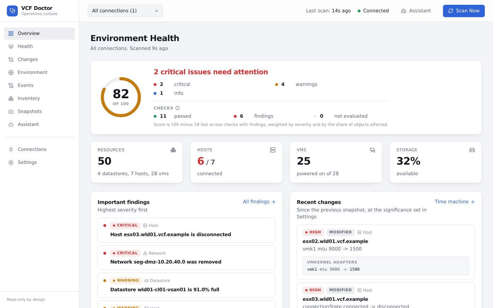
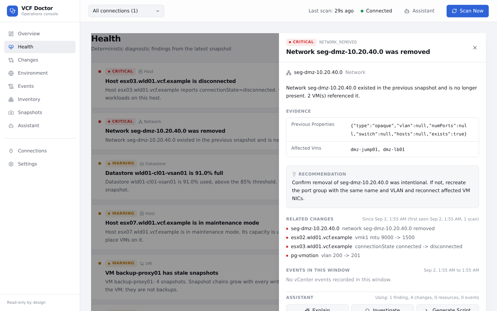
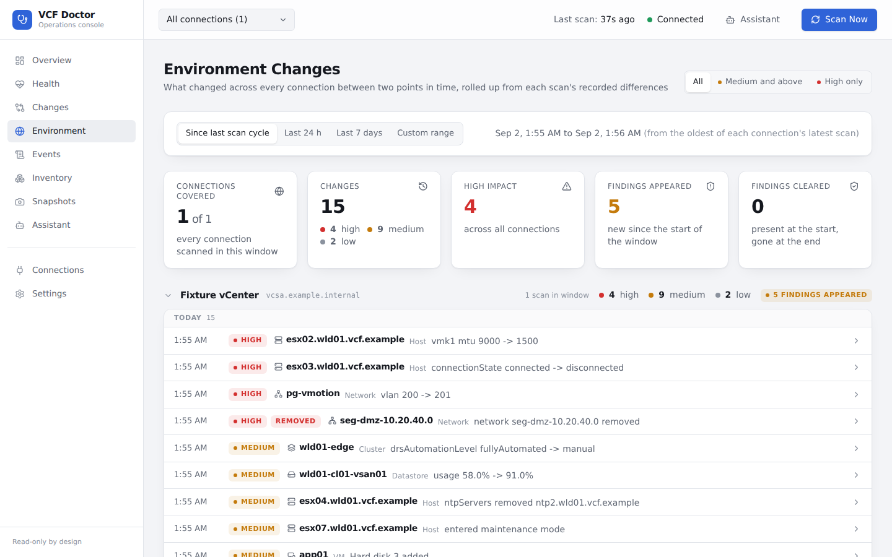
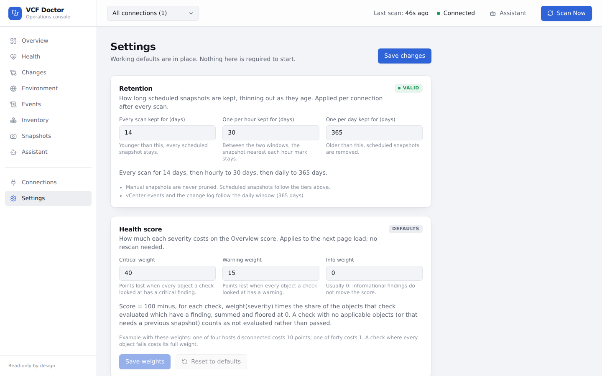

# VCF Doctor

What's wrong, what changed, and what should I do about it?

VCF Doctor is an operations console for VMware Cloud Foundation. It connects
to one or more vCenters, captures a full inventory snapshot on a schedule, and
runs a fixed set of deterministic health checks against every snapshot. Because
snapshots are kept (every scan for two weeks, thinning to hourly and then daily
for a year by default; manual snapshots are kept indefinitely), it can show
exactly what changed between any two retained points in time, per object or
rolled up across the whole estate, and tie each finding to the changes and
vCenter events around it. An optional Claude-powered
assistant explains a finding in plain language or drafts a PowerCLI
investigation script from the recorded evidence; it never decides what is
healthy and never runs anything. The console is read-only by design.



## Features

- **Multiple vCenters, scanned on a schedule.** Add a vCenter in the GUI, set
  its interval, walk away. Scan Now for an on-demand snapshot.
- **Deterministic health checks.** Disconnected and maintenance-mode hosts,
  DRS and HA off, full datastores, stale VM snapshots, removed networks and
  hosts, and more. Same input, same finding, every time.
- **Health score.** One severity-weighted number per estate, weights editable
  in Settings. The Overview and Settings explain the current scoring formula,
  including removal scoring by resource type. The evaluated count still covers
  all applicable objects. See the [diagnostic contracts](docs/PROPERTIES.md#new-diagnostic-checks)
  for host version comparison eligibility.
- **Time machine.** Pick any two snapshots and see the semantic difference,
  not a raw JSON diff. Environment Changes rolls the same data up across every
  connection for a time window.
- **Evidence, not guesses.** Each finding opens with the properties behind it,
  the related changes, and the vCenter events in the same window.
- **Assistant, optional.** Explain, investigate, or generate a script, grounded
  only in the evidence shown. Scripts are labelled READ ONLY or MODIFIES
  ENVIRONMENT and are never executed.
- **Retention that thins with age.** Every scan for 14 days, hourly for 30,
  daily for a year, all adjustable in Settings. Manual snapshots are kept.
- **Sensible defaults.** Every setting has a GUI control and a working default.
  A fresh install runs with nothing pre-configured. There is no
  sample-data mode; it expects a live vCenter.
- **Visible build identity.** Settings, About shows the running version, Git
  commit, and build time in your browser's local time. See the
  [build identity contract](docs/DEPLOYMENT.md#contract) for API and local-build details.

## Getting started

Read the [Getting Started guide](docs/GETTING_STARTED.md). The short version:

```bash
docker run -d --name vcf-doctor -p 8000:8000 -v vcf-doctor-data:/data \
  ghcr.io/sentania-labs/vcf-doctor:latest
```

Open http://localhost:8000, set the operator password, add a vCenter, and
click Scan Now.

## Screenshots

| Health finding with evidence and related changes | Environment Changes across the estate |
|---|---|
|  |  |



## Documentation

| Document | What it covers |
|---|---|
| [Getting Started](docs/GETTING_STARTED.md) | First run, password, first vCenter, first scan, where to look |
| [Deployment](docs/DEPLOYMENT.md) | Image, port, volume, replica rules, every environment variable |
| [Security](docs/SECURITY.md) | Access model, secrets at rest, browser headers, CI gates, supply chain |
| [Retention, change log and events](docs/RETENTION_EVENTS.md) | How snapshots thin out and what the change log and event store keep |
| [Resource properties](docs/PROPERTIES.md) | The normalised inventory schema every check and diff keys on |
| [Status](STATUS.md) | What is delivered, what is owed, open follow-ups |
| [MVP plan](docs/PLAN.md), [original plan](docs/ORIGINAL_PLAN.md) | Historical design documents with a dated list of decisions since |

## Contributing

See [CONTRIBUTING.md](CONTRIBUTING.md) for the local workflow and the PR bar.
Bugs and ideas go in [GitHub issues](https://github.com/sentania-labs/vcf-doctor/issues).

## License

MIT. See [LICENSE](LICENSE).

## Upgrade notes: event compaction

Existing SQLite databases with auto-vacuum disabled receive a one-time startup
migration to incremental reclamation. This performs one full VACUUM before the
scheduler starts, under the shared single-writer lock. Startup can take longer
while the database is rewritten. Free space on the database volume must be at
least 1.5 times the database file size. A durable migration marker and SQLite's
mode prevent repeat rewrites; routine scan cleanup remains bounded.

If space is insufficient, startup continues without compaction. Settings > Events
retention shows `compaction unavailable: needs N MB free`. Free space and choose
**Run compaction migration now** to retry the same guarded migration. Database
writes wait for the migration to finish. The migration preserves events and
settings; subsequent [event retention](docs/RETENTION_EVENTS.md#events-and-tasks)
cleanup applies the independent limits to existing history too.
